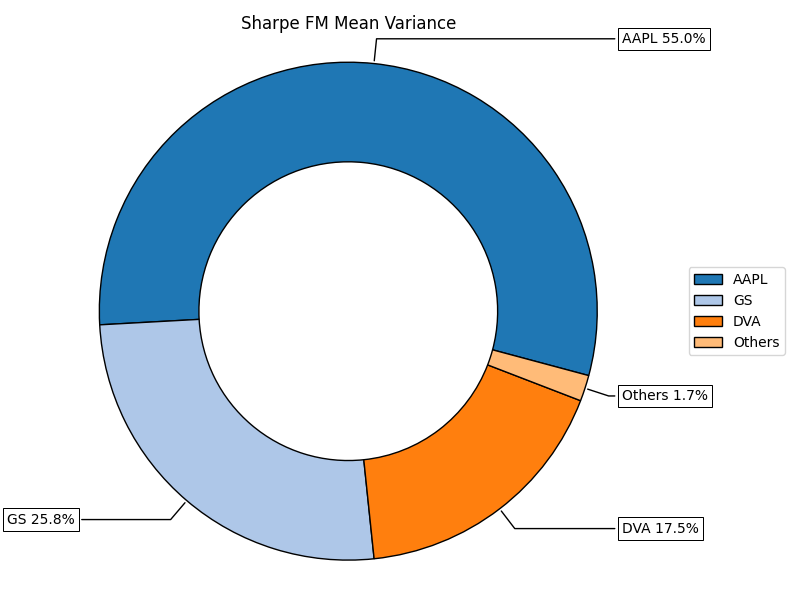

# Portfolio Analysis Using Factor Model Mean-Variance Optimization

## Introduction

As an enthusiastic investor, I consistently expand my stock portfolio, which currently includes investments in companies such as Alibaba, Alphabet Inc. (Google), Berkshire Hathaway (both A and B shares), and Ahold Delhaize. Combining my passion for investing with my academic background in Data Science & AI, I sought to apply advanced financial modeling techniques to analyze someone else's portfolio: that of Berkshire Hathaway.

## Project Overview

In this project, I used a **Factor Model Mean-Variance Optimization** approach to maximize the Sharpe ratio of a portfolio inspired by Berkshire Hathaway's stock holdings. The Sharpe ratio is a key metric in finance that evaluates the return of an investment compared to its risk, making it an essential tool for portfolio optimization.

### Methodology

- **Factor Model (FM):** Utilized to account for the systematic risk factors that influence the returns of the stocks in the portfolio.
- **Mean-Variance (MV) Optimization:** Applied to allocate assets in a way that maximizes the Sharpe ratio, balancing the trade-off between expected return and risk.

### Selected Portfolio: Berkshire Hathaway Stocks

The portfolio in this analysis comprises stocks that are significant holdings of Berkshire Hathaway, the investment company led by Warren Buffett. These stocks were chosen because they represent a diversified and well-established portfolio, known for strong long-term performance and strategic value.

Here are the companies included:

- **Apple Inc. (AAPL)**
- **Bank of America Corp. (BAC)**
- **The Coca-Cola Company (KO)**
- **American Express Co. (AXP)**
- **The Kraft Heinz Company (KHC)**
- **Moody's Corporation (MCO)**
- **Verizon Communications Inc. (VZ)**
- **Chevron Corporation (CVX)**
- **DaVita Inc. (DVA)**
- **The Bank of New York Mellon Corporation (BK)**
- **U.S. Bancorp (USB)**
- **Citigroup Inc. (C)**
- **Visa Inc. (V)**
- **Mastercard Inc. (MA)**
- **Johnson & Johnson (JNJ)**
- **Procter & Gamble Co. (PG)**
- **United Parcel Service Inc. (UPS)**
- **The Goldman Sachs Group, Inc. (GS)**
- **Wells Fargo & Company (WFC)**
- **General Motors Company (GM)**

### Results

The outcome of the analysis is visualized through various charts, including:

1. **Factor Loadings Heatmap:** Illustrates how each stock in the portfolio is influenced by different risk factors.
2. **Portfolio Allocation Pie Chart:** Displays the optimal allocation of assets in the portfolio, designed to maximize the Sharpe ratio.

### Inspiration

This project was inspired by a project from Jason from PyQuant.: [Jason from PyQuant](hhttps://www.pyquantnews.com/).

## Discussion

Through this analysis, I've applied machine learning and financial modeling techniques to explore how a strategically selected portfolio, such as one mirroring Berkshire Hathaway's investments, could be optimized for better risk-adjusted returns.

It was a good way for me to learn methods further outside of my expertise of Artificial Intelligence.
